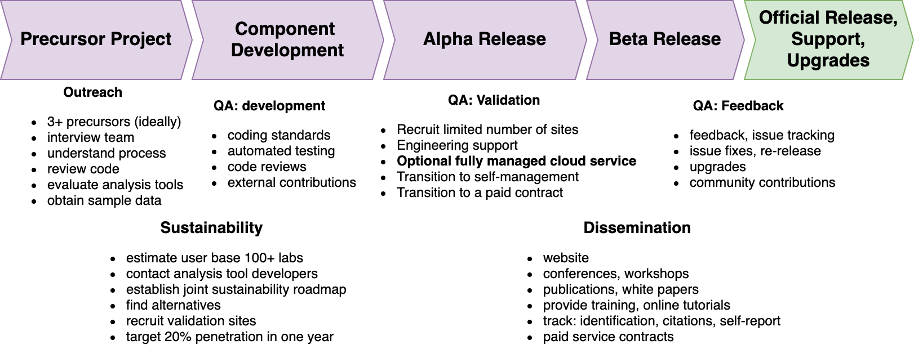

# Management Plan 

DataJoint Elements has established a Resource Management Plan to select projects for development, to assure quality, and to disseminate its output as summarized in the figure below:

The following sections provide detailed information.

* [Team](Team.md)
* [Project Governance](Governance.md)
* [Project Selection Process](Selection.md)
* [Quality Assurance](QualityAssurance.md)
* [Contribution Guideline](Contribute.md)
* [Outreach Plan](Outreach.md)
* [Licenses and User Agreements](Licenses.md)

&copy; DataJoint NEURO, 2021
